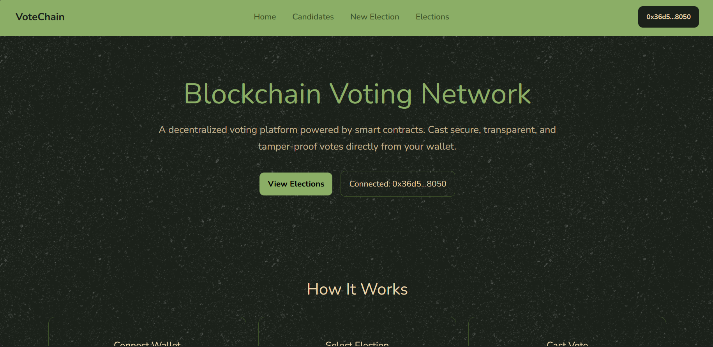
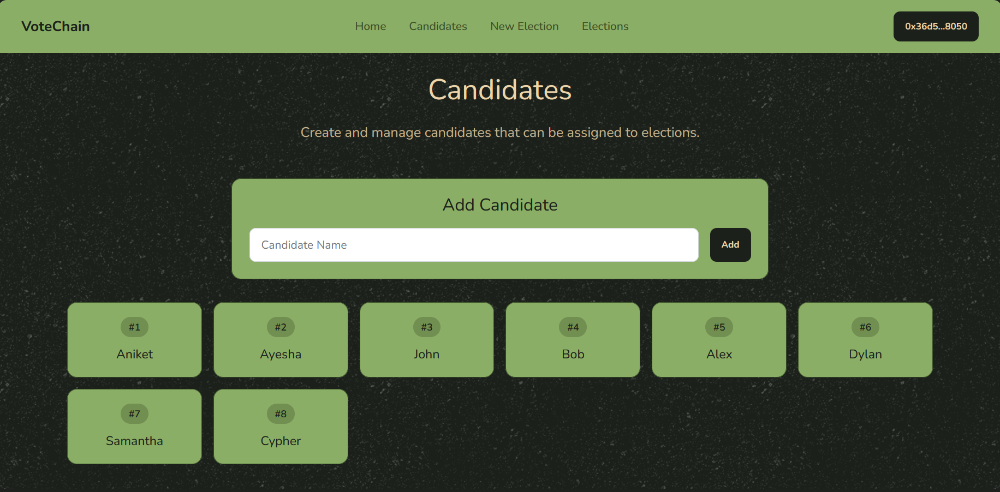
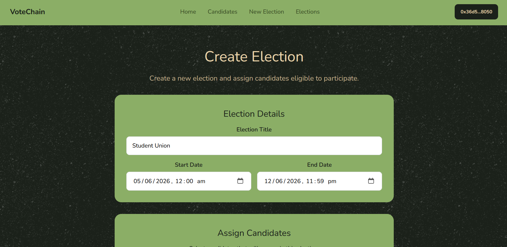
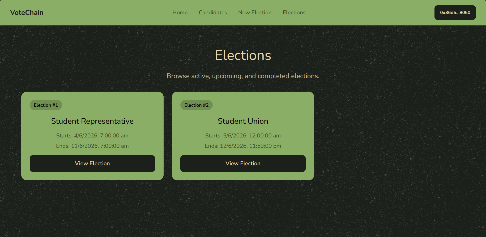
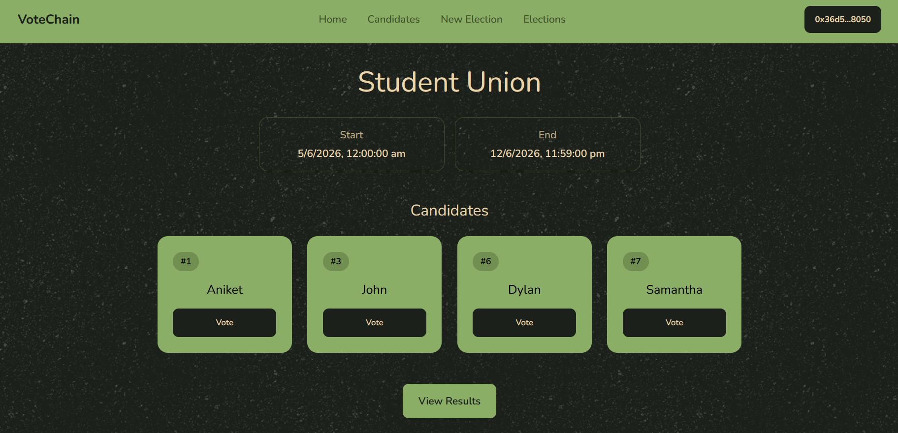
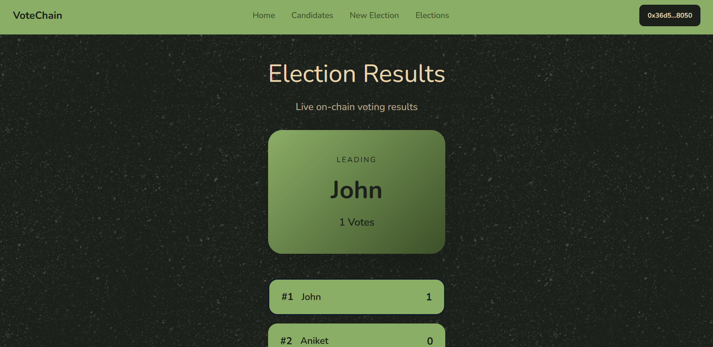

# Blockchain Voting Network

A decentralized blockchain-based voting application built using Solidity, Foundry, React, Ethers.js, and MetaMask. The system allows an administrator to create elections, register candidates, assign candidates to elections, and enables users to cast secure on-chain votes through their wallets.

---

# Table of Contents

* [Tech Stack](#tech-stack)

  * [Frontend](#frontend)
  * [Blockchain](#blockchain)
* [Project Features](#project-features)
* [Folder Structure](#folder-structure)
* [Smart Contract Architecture](#smart-contract-architecture)

  * [Election Management](#election-management)
  * [Candidate Management](#candidate-management)
  * [Voting Mechanism](#voting-mechanism)
* [Contract Storage Design](#contract-storage-design)
* [Voting Flow](#voting-flow)
* [Smart Contract Functions](#smart-contract-functions)

  * [Election Functions](#election-functions)
  * [Candidate Functions](#candidate-functions)
  * [Voting Functions](#voting-functions)
  * [View Functions](#view-functions)
* [Frontend Architecture](#frontend-architecture)

  * [Wallet Context](#wallet-context)
  * [Role-Based Access Control](#role-based-access-control)
  * [Routing Structure](#routing-structure)
* [Installation Guide](#installation-guide)

  * [1. Clone Repository](#1-clone-repository)
  * [2. Install Dependencies](#2-install-dependencies)
  * [3. Compile Contracts](#3-compile-contracts)
  * [4. Local Deployment](#4-local-deployment)
  * [5. Start Frontend](#5-start-frontend)
* [Screenshots](#screenshots)
* [Learning Outcomes](#learning-outcomes)
* [Author](#author)

---

# Tech Stack

## Frontend

* React
* React Router DOM
* Ethers.js
* Context API
* CSS

---

## Blockchain

* Solidity
* Foundry
* MetaMask

---

# Project Features

* MetaMask Wallet Authentication
* Decentralized On-Chain Voting
* Election Creation
* Candidate Registration
* Candidate Reusability Across Elections
* Election Candidate Assignment
* One Vote Per Wallet Per Election
* Election Scheduling Using Blockchain Timestamps
* Live Election Results
* Role-Based Admin Controls
* Smart Contract Events
* Fully Decentralized Architecture

---

# Folder Structure

```bash
Blockchain-Voting-Network/
│
├── frontend/
│   ├── src/
│   │   ├── abi/
│   │   ├── components/
│   │   ├── config/
│   │   ├── context/
│   │   ├── pages/
│   │   ├── styles/
│   │   ├── App.jsx
│   │   └── main.jsx
│   │
│   └── package.json
│
├── smart-contract/
│   ├── src/
│   │   └── Voting.sol
│   │
│   ├── script/
│   │   ├── VotingDeploy.s.sol
│   │   └── Interactions.s.sol
│   │
│   ├── test/
│   │   └── Voting.t.sol
│   │
│   ├── foundry.toml
│   └── package.json
│
└── README.md
```

---

# Smart Contract Architecture

## Election Management

The contract owner can:

* Create elections
* Define election start time
* Define election end time
* Assign existing candidates to elections

---

## Candidate Management

The contract owner can:

* Create candidates
* Reuse candidates across multiple elections
* Manage election participation

Example:

```text
Alice
 ├── Election 1
 └── Election 2

Bob
 └── Election 1

Charlie
 └── Election 2
```

---

## Voting Mechanism

Users vote directly through their wallets.

Voting rules:

* One vote per wallet per election
* Users may vote in multiple elections
* Votes are stored permanently on-chain
* Election participation is validated before voting

---

# Contract Storage Design

```solidity
uint256 private sElectionCount;
uint256 private sCandidateCount;

mapping(uint256 => Election) private sElections;
mapping(uint256 => Candidate) private sCandidates;
mapping(uint256 => uint256[]) private sElectionIdToCandidateIds;
mapping(uint256 => mapping(uint256 => bool)) private sElectionIdToCandidateIdToIsParticipating;
mapping(uint256 => mapping(uint256 => uint256)) private sElectionIdToCandidateIdToVoteCount;
mapping(uint256 => mapping(address => bool)) private sElectionIdToVoterToHasVoted;
```

---

# Voting Flow

```text
Admin Creates Candidate
		  ↓
Admin Creates Election
		  ↓
Admin Assigns Candidates
		  ↓
Election Starts
		  ↓
User Connects MetaMask
		  ↓
User Casts Vote
		  ↓
Vote Stored On Chain
		  ↓
Results Updated
```

---

# Smart Contract Functions

# Election Functions

| Function                  | Description             |
| ------------------------- | ----------------------- |
| createElection()          | Create new election     |
| getElectionById()         | Get election details    |
| getElectionCount()        | Get total elections     |
| getElectionCandidateIds() | Get assigned candidates |

---

# Candidate Functions

| Function                 | Description                  |
| ------------------------ | ---------------------------- |
| createCandidate()        | Create candidate             |
| getCandidateById()       | Get candidate details        |
| getCandidateCount()      | Get total candidates         |
| addCandidateToElection() | Assign candidate to election |

---

# Voting Functions

| Function   | Description        |
| ---------- | ------------------ |
| vote()     | Cast vote          |
| userHasVoted() | Check voter status |

---

# View Functions

| Function             | Description              |
| -------------------- | ------------------------ |
| getVoteCount()       | Get candidate vote count |
| getElectionResults() | Get election results     |
| getOwner()           | Get contract owner       |

---

# Frontend Architecture

# Wallet Context

Global wallet state is managed using:

```text
WalletContext
```

Stores:

```text
provider
signer
account
contract
isConnected
isOwner
```

---

# Role-Based Access Control

The frontend determines ownership using:

```solidity
getOwner()
```

Only owners can:

* Create candidates
* Create elections
* Assign candidates

---

# Routing Structure

```text
/
│
├── /elections
│
├── /elections/:id
│
├── /results/:id
│
├── /admin/candidates
│
└── /admin/create-election
```

---

# Installation Guide

# 1. Clone Repository

```bash
git clone https://github.com/Aniket-Roy22/Blockchain-Voting-Network.git
```

---

# 2. Install Dependencies

Frontend:

```bash
cd client
npm install
```

Smart Contract:

```bash
cd contracts
forge install
```

---

# 3. Compile Contracts

```bash
forge build
```

---

# 4. Local Deployment

Start local blockchain:

```bash
anvil
```

Deploy:

```bash
forge script script/VotingDeploy.s.sol \
--rpc-url http://127.0.0.1:8545 \
--private-key <PRIVATE_KEY> \
--broadcast
```

---

# 5. Start Frontend

```bash
cd frontend
npm run dev
```

Frontend runs on:

```text
http://localhost:5173
```

---

# Screenshots

## Home Page



---

## Candidates Page



---

## Create Election Page



---

## Elections Page



---

## Election Details



---

## Results Page



---

# Learning Outcomes

* Smart Contract Development with Solidity
* Foundry Toolchain
* Blockchain State Management
* Smart Contract Deployment
* MetaMask Integration
* Ethers.js Contract Interaction
* React Context API
* Decentralized Application Architecture
* On-Chain Data Retrieval
* Event-Driven Frontend Updates

---

# Author

**Intern ID:** CITS730

**Full Name:** Aniket Roy

**No. of Weeks:** 4

**Project Name:** Blockchain Voting Network

**Project Scope:** The project aims to build a decentralized blockchain voting platform where administrators can create elections, register candidates, assign candidates to elections, and allow users to cast secure on-chain votes through MetaMask. The application demonstrates smart contract development, decentralized state management, wallet integration, and frontend-blockchain interaction using Solidity, Foundry, React, and Ethers.js.